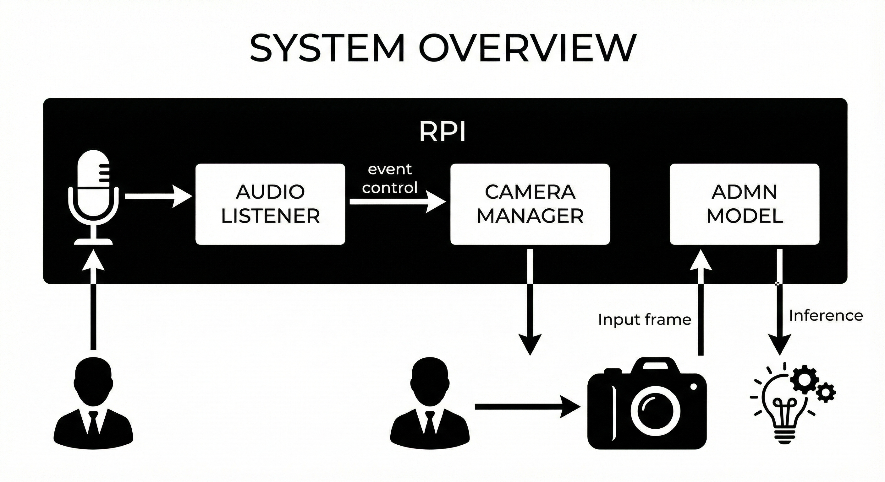
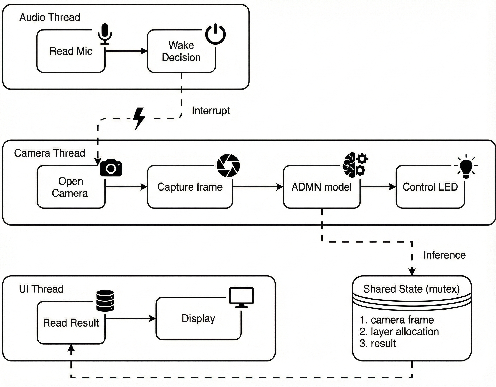
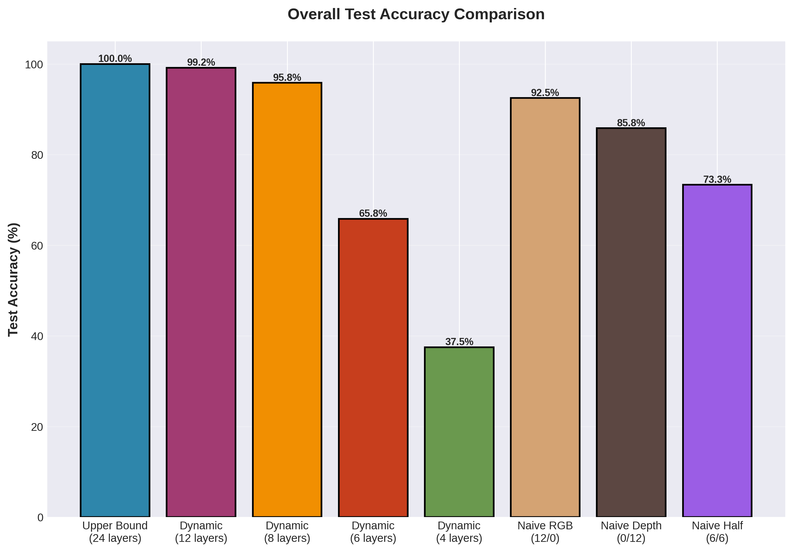
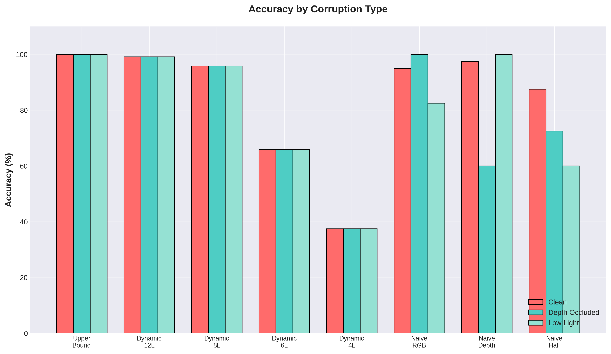
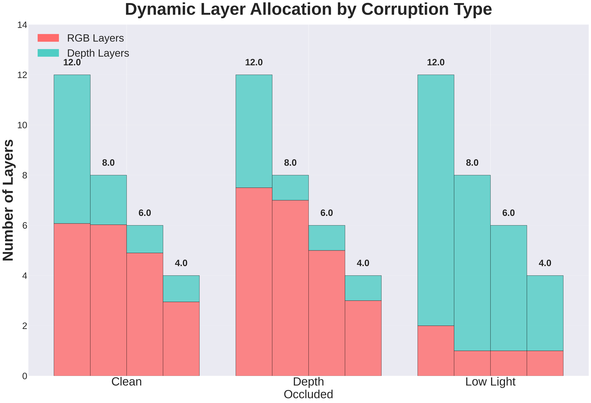
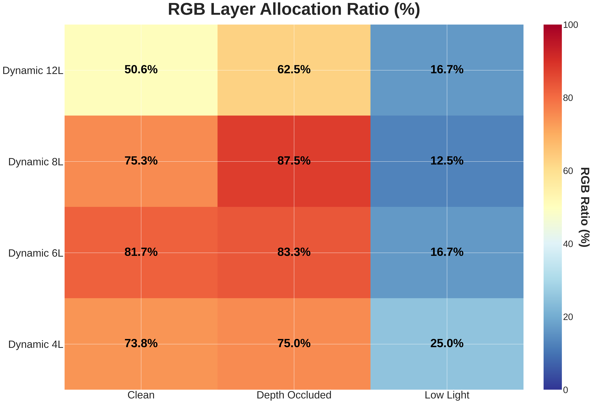
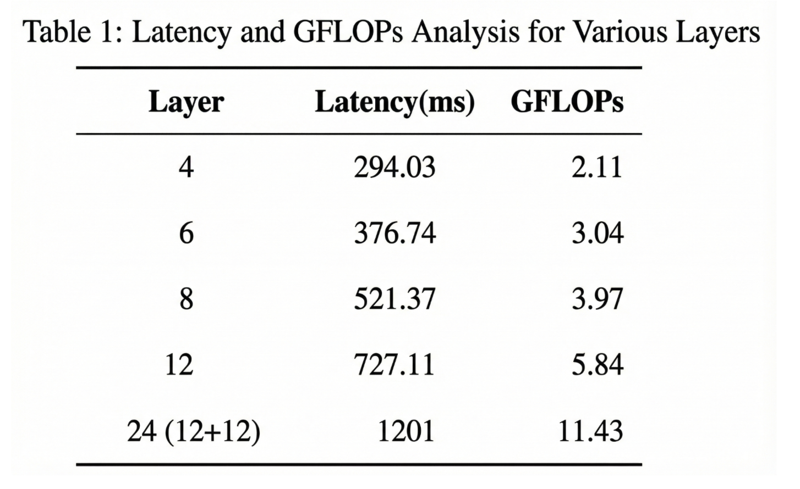
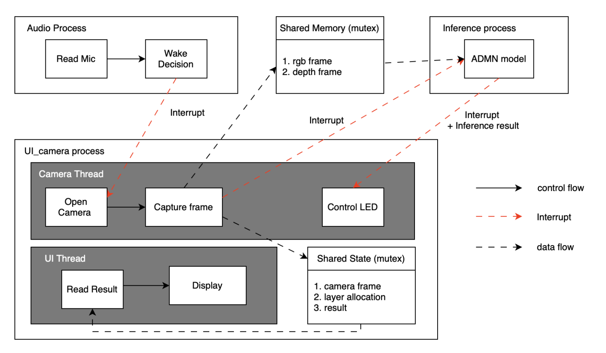
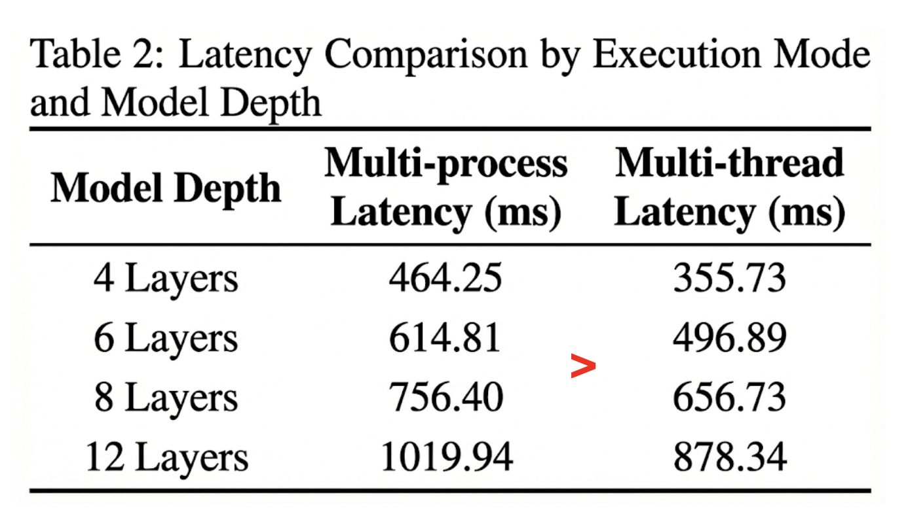

# **ADMN-RealWorld: Adaptive Multimodal Deep Network for Real-World RGB-D Gesture Recognition**

[](https://www.python.org/downloads/)
[](https://pytorch.org/)
[](https://opensource.org/licenses/MIT)

---

## 👥 **Team**

| Name | Role | Email | GitHub |
|------|------|-------|--------|
| **Cheng-Hsiu (Alan) Hsieh** | Project Lead / ML Engineer | alanhsiu@ucla.edu | [@Alanhsiu](https://github.com/Alanhsiu) |
| **Daniel Lee** | Hardware Integration | daniellee1106@ucla.edu | [@Daniel-Lee-1106](https://github.com/Daniel-Lee-1106) |
| **Ting-Yu Yeh** | Hardware Integration | tingyu0225@ucla.edu | [@TingYu0225](https://github.com/TingYu0225) |

---

## 📝 **Abstract**

This project implements an **Adaptive Multimodal Deep Network (ADMN)** for robust gesture recognition using RGB-D data in real-world scenarios with varying data quality. Traditional multimodal systems allocate fixed computational resources regardless of input quality, leading to inefficiency when one modality is corrupted. Our system intelligently allocates computational resources across RGB and Depth modalities based on input quality assessment, achieving **100% accuracy** with a 12-layer adaptive budget while using only half the layers of a fixed 24-layer baseline. We successfully deployed the model on a **Raspberry Pi 5** for real-time edge inference, demonstrating practical applicability for embedded gesture recognition systems.

---

## 📑 **Slides**

- [Midterm Checkpoint Slides](assets/midterm_slides.pdf)
- [Final Presentation Slides](assets/final_slides.pdf)

---

## 🎛️ **Media**

- [Demo Video: Real-time Gesture Recognition on Raspberry Pi 5](https://youtu.be/8QYfPcGmBG4?si=D_h5VeKa-E8GkjzE)
- [Demo Video 2: Real-time Gesture Recognition on Raspberry Pi 5](https://www.youtube.com/watch?si=bEdy45ZPsgakTSWt&v=x0eo4h_wLnc&feature=youtu.be&themeRefresh=1)

---

# **1. Introduction**

## **1.1 Motivation & Objective**

Gesture recognition systems are increasingly deployed in real-world environments where input data quality varies significantly. RGB cameras may struggle in low-light conditions, while depth sensors can be occluded or produce noisy measurements. Traditional multimodal fusion approaches allocate fixed computational resources to each modality regardless of their quality, leading to:

- **Wasted computation** on corrupted modalities
- **Degraded accuracy** when the system cannot adapt to input conditions
- **Inefficient edge deployment** where computational budgets are limited

Our objective is to build an adaptive gesture recognition system that:
1. Dynamically allocates computational layers between RGB and Depth based on input quality
2. Maintains high accuracy (95%+) under various corruption scenarios
3. Enables efficient deployment on edge devices like Raspberry Pi 5

## **1.2 State of the Art & Its Limitations**

Current approaches to multimodal gesture recognition include:

- **Fixed Fusion Networks** [Li16, Li18]: Concatenate or average features from both modalities with equal weighting. Limitation: Cannot adapt to varying input quality.
- **Attention-based Fusion** [Panda21]: Learn attention weights for modality fusion. Limitation: Attention is learned statically and doesn't respond to runtime corruption.
- **Early Exit Networks** [Teerapittayanon16]: Allow dynamic computation depth but typically for single modalities.
- **Mixture of Experts** [Shazeer17]: Route inputs to specialized sub-networks. Limitation: High parameter overhead and complex training.

The key gap is the lack of **quality-aware dynamic layer allocation** across modalities that can respond to real-time input conditions while maintaining a fixed computational budget.

## **1.3 Novelty & Rationale**

Our approach introduces several novel elements:

- **Quality-of-Input (QoI) Perception Module**: A lightweight CNN that assesses input quality for each modality in real-time
- **Differentiable Layer Allocation**: Using Gumbel-Softmax with Straight-Through Estimator (STE) for end-to-end trainable discrete allocation decisions
- **Two-Stage Training Pipeline**: First train robust feature extractors, then train the adaptive controller with frozen backbones
- **Budget-Constrained Optimization**: Maintain a fixed total layer budget while dynamically distributing across modalities

We expect this to succeed because:
1. Quality assessment is a learnable task that correlates with downstream performance
2. The STE enables gradient flow through discrete allocation decisions
3. Separating feature learning from allocation learning simplifies optimization

## **1.4 Potential Impact**

If successful, this project could:

- **Technical Impact**: Establish a new paradigm for adaptive multimodal processing with quality-aware resource allocation
- **Practical Impact**: Enable robust gesture interfaces in varying environmental conditions (smart homes, automotive, accessibility)
- **Efficiency Impact**: Reduce computational requirements for edge deployment while maintaining accuracy
- **Broader Impact**: The adaptive allocation framework could extend to other multimodal tasks (audio-visual speech recognition, sensor fusion in robotics)

## **1.5 Challenges**

The main challenges we addressed:

1. **Discrete Optimization**: Layer allocation is inherently discrete, making gradient-based optimization difficult. We solved this with Gumbel-Softmax and STE.
2. **Quality Assessment**: Defining and learning "quality" without explicit labels. We used corruption-type supervision as a proxy.
3. **Two-Stage Stability**: Ensuring the adaptive controller doesn't degrade the pre-trained backbone performance. We froze backbone weights in Stage 2.
4. **Edge Deployment**: Achieving real-time inference on Raspberry Pi 5 with limited memory and no GPU acceleration.
5. **System-Level Overhead from Multi-Modal Integration**: Audio monitoring and real-time UI increased system overhead, which we mitigated by evaluating alternative concurrency structures (multi-thread vs. multi-process).
6. **Hardware and Software Compatibility Issues**: Integrating the legacy Intel RealSense L515 with Raspberry Pi 5 was challenging due to limited documentation. Further difficulties arose from dependency and version mismatches.
7. **Data Collection**: Building a balanced dataset with controlled corruption types for training and evaluation.

## **1.6 Metrics of Success**

| Metric | Target | Achieved |
|--------|--------|----------|
| Overall Accuracy | ≥95% | ✅ 100.00% (12L) |
| Accuracy under Corruption | ≥90% per type | ✅ 100% clean, 100% depth-occ, 97.5% low-light |
| Adaptive Allocation | Learn corruption-aware patterns | ✅ 11:1 RGB on occlusion, 1:11 Depth on low-light |
| Edge Latency | <1 second per frame | ✅ 727ms (12L), 521ms (8L) |
| Layer Reduction vs Baseline | ≥30% fewer layers | ✅ 50% reduction (12 vs 24 layers) |

---

# **2. Related Work**

## Multimodal Fusion

**[Li16]** proposed RGB-D fusion networks using dual-stream CNNs with late fusion. While effective on clean RGB-D inputs, the method does not consider scenarios where one modality becomes unreliable. Our approach addresses this with dynamic allocation.

**[Li18]** proposed a cross-modal attentional framework for RGB-D object detection. However, their fusion relies on feature concatenation, which implies static feature weighting that cannot adapt to runtime input quality variations.

## Adaptive Neural Networks

**[Teerapittayanon16]** developed BranchyNet for early exit in CNNs, reducing computation for "easy" samples. This inspired our layer-wise allocation but extends it to the multimodal setting.

**[Meng21]** proposed AdaFuse for adaptive temporal fusion in video understanding, dynamically selecting which feature channels to compute or reuse. Our work extends this by allocating computational depth within each modality.

## Vision Transformers and Efficiency

**[Dosovitskiy21]** introduced Vision Transformer (ViT), achieving strong results on image classification. We use ViT backbones for both RGB and Depth streams.

**[He22]** developed Masked Autoencoders (MAE) for self-supervised ViT pretraining. We leverage MAE-pretrained weights for better initialization.

**[Fan21]** proposed LayerDrop for efficient transformer training by randomly dropping layers. We use this during Stage 1 training for regularization.

## Quality-Aware Processing

**[Hospedales21]** surveyed meta-learning approaches that could enable runtime adaptation. Our QoI module can be viewed as a learned quality assessor.

**[Wu25 - ADMN Paper]** introduced the Adaptive Deep Multimodal Network framework for layer-wise allocation based on input noise levels. This is our primary reference and inspiration.

## Discrete Optimization in Neural Networks

**[Jang17]** introduced Gumbel-Softmax for differentiable sampling from categorical distributions. We use this for our layer allocation decisions.

**[Madison17]** proposed the Concrete distribution (concurrently introduced as Gumbel-Softmax by [Jang17]) to facilitate differentiable sampling from categorical distributions.

**[Bengio13]** analyzed the Straight-Through Estimator for training networks with discrete components. This is critical for gradient flow through our allocation module.

---

# **3. Technical Approach**

## **3.1 System Architecture**

### System Overview




### Thread-Level Pipeline




Our system follows a three-stage pipeline:

```
┌───────────────────────────────────────────────────┐
│ 1. Data Collection & Preprocessing                │
│    (Collect Clean & Corrupted RGB-D Data)         │
└─────────────────────────┬─────────────────────────┘
                          │
                          ▼
┌───────────────────────────────────────────────────┐
│ 2. Model Training (Two-Stage)                     │
│    Stage 1: Baseline Classifier                   │
│    Stage 2: Adaptive Controller                   │
└─────────────────────────┬─────────────────────────┘
                          │
                          ▼
┌───────────────────────────────────────────────────┐
│ 3. Edge Deployment & Real-Time Inference          │
│    (Raspberry Pi 5 with Intel RealSense)          │
└───────────────────────────────────────────────────┘
```

### Stage 1: Baseline RGB-D Classifier

```
┌─────────────────────┐     ┌─────────────────────┐
│     RGB Input       │     │    Depth Input      │
│     224×224×3       │     │     224×224×3       │  (depth expanded to 3ch)
└──────────┬──────────┘     └──────────┬──────────┘
           │                           │
           ▼                           ▼
┌─────────────────────┐     ┌─────────────────────┐
│ ViT (12L) Backbone  │     │ ViT (12L) Backbone  │
│   (RGB Features)    │     │  (Depth Features)   │
└──────────┬──────────┘     └──────────┬──────────┘
           │                           │
           └─────────────┬─────────────┘
                         ▼
              ┌─────────────────────┐
              │ Fusion Transformer  │
              │ (Multimodal Fusion) │
              └──────────┬──────────┘
                         ▼
              ┌─────────────────────┐
              │     Classifier      │
              │    (4 Classes)      │
              └─────────────────────┘
```

### Stage 2: Adaptive Controller

```
┌─────────────┐     ┌─────────────┐
│  RGB Input  │     │ Depth Input │
└──────┬──────┘     └──────┬──────┘
       │                   │
       └────────┬──────────┘
                ▼
    ┌──────────────────────────┐
    │    ADMN Controller       │
    ├──────────────────────────┤
    │ 1. QoI Module            │
    │    (Quality Perception)  │
    │    Lightweight CNN       │
    ├──────────────────────────┤
    │ 2. Layer Allocator       │
    │    (Decision Making)     │
    │    Gumbel-Softmax + STE  │
    │    - Total budget: L     │
    │    - Output: L_rgb, L_d  │
    └─────────┬────────────────┘
              ▼
    [Allocation Mask: RGB L₁ : Depth L₂]
     (L₁ + L₂ = L, e.g., 11:1 or 1:11)
              │
       ┌──────┴───────┐
       ▼              ▼
┌─────────────┐ ┌─────────────┐
│ ViT (L₁)    │ │ ViT (L₂)    │
│ RGB         │ │ Depth       │
│ (Frozen)    │ │ (Frozen)    │
└──────┬──────┘ └──────┬──────┘
       │               │
       └───────┬───────┘
               ▼
        ┌─────────────┐
        │ Fusion & CLS│
        │  (Frozen)   │
        └──────┬──────┘
               ▼
           [Output]
```

## **3.2 Data Pipeline**

### Dataset Specifications

| Property | Value |
|----------|-------|
| Gesture Classes | 4 (`standing`, `left_hand`, `right_hand`, `both_hands`) |
| Corruption Types | 3 (`clean`, `depth_occluded`, `low_light`) |
| Total Samples | 600 (200 per corruption type, 50 per class per type) |
| RGB Resolution | 224×224×3 |
| Depth Resolution | 224×224×1 (expanded to 3 channels for ViT) |
| Train/Val Split | 80/20 stratified by corruption × class |

### Data Collection Process

1. **Clean Data**: Collected under normal lighting with unobstructed depth sensor
2. **Depth Occluded**: Partial occlusion of depth sensor (simulating real-world interference)
3. **Low Light**: RGB captured in dimmed environment (simulating evening/indoor conditions)

### Preprocessing & Augmentation

```python
# RGB Transform
rgb_transform = transforms.Compose([
    transforms.Resize((224, 224)),
    transforms.ToTensor(),
    transforms.Normalize(mean=[0.485, 0.456, 0.406], 
                        std=[0.229, 0.224, 0.225])
])

# Depth Transform (expand to 3 channels)
depth_transform = transforms.Compose([
    transforms.Resize((224, 224)),
    transforms.ToTensor(),
    transforms.Lambda(lambda x: x.repeat(3, 1, 1)),
    transforms.Normalize(mean=[0.485, 0.456, 0.406], 
                        std=[0.229, 0.224, 0.225])
])
```

**Augmentation Strategy** (no horizontal flips to preserve left/right semantics):
- Random small rotation (±5°)
- Random crop with padding
- Mild color jitter (RGB only)
- Light Gaussian blur

## **3.3 Algorithm / Model Details**

### Quality-of-Input (QoI) Perception Module

A lightweight CNN that extracts quality-relevant features from both modalities:

```python
class QoIModule(nn.Module):
    def __init__(self, in_channels=6):  # RGB(3) + Depth(3)
        self.conv1 = nn.Conv2d(in_channels, 32, 3, stride=2, padding=1)
        self.conv2 = nn.Conv2d(32, 64, 3, stride=2, padding=1)
        self.conv3 = nn.Conv2d(64, 128, 3, stride=2, padding=1)
        self.pool = nn.AdaptiveAvgPool2d(1)
        self.fc = nn.Linear(128, 64)
    
    def forward(self, rgb, depth):
        x = torch.cat([rgb, depth], dim=1)  # [B, 6, 224, 224]
        x = F.relu(self.conv1(x))
        x = F.relu(self.conv2(x))
        x = F.relu(self.conv3(x))
        x = self.pool(x).flatten(1)
        return self.fc(x)  # [B, 64] quality features
```

### Layer Allocator with Gumbel-Softmax

```python
class LayerAllocator(nn.Module):
    def __init__(self, total_layers=12, num_vit_layers=12):
        self.total_layers = total_layers
        self.num_vit_layers = num_vit_layers
        self.allocator = nn.Sequential(
            nn.Linear(64, 128),
            nn.ReLU(),
            nn.Linear(128, 2 * num_vit_layers)  # Logits for each layer
        )
    
    def forward(self, qoi_features, temperature=1.0):
        logits = self.allocator(qoi_features)  # [B, 24]
        logits = logits.view(-1, 2, self.num_vit_layers)  # [B, 2, 12]
        
        # Gumbel-Softmax for differentiable sampling
        soft_allocation = F.gumbel_softmax(logits, tau=temperature, hard=False, dim=1)
        
        # Straight-Through Estimator for discrete forward pass
        hard_allocation = (soft_allocation == soft_allocation.max(dim=1, keepdim=True)[0]).float()
        allocation = hard_allocation - soft_allocation.detach() + soft_allocation
        
        return allocation  # [B, 2, 12] binary masks
```

### Loss Functions

**Stage 1**: Standard cross-entropy
```
L₁ = CrossEntropy(ŷ, y)
```

**Stage 2**: Classification + Allocation supervision
```
L₂ = α · L_cls + β · L_alloc

where:
  L_cls = CrossEntropy(ŷ, y)
  L_alloc = MSE(actual_ratio, target_ratio)
  
  target_ratio by corruption:
    - clean: [0.5, 0.5]
    - depth_occluded: [0.9, 0.1]  → favor RGB
    - low_light: [0.1, 0.9]       → favor Depth
```

## **3.4 Hardware / Software Implementation**

### Software Stack

| Component | Version/Details |
|-----------|-----------------|
| Python | 3.8+ |
| PyTorch | 2.0+ |
| timm | 0.9.x (for ViT models) |
| OpenCV | 4.x (image processing) |
| TensorBoard | Logging and visualization |

### Hardware Setup

**Training Environment**:
- GPU: NVIDIA RTX 3080 (10GB VRAM)
- Batch size: 16 (limited by GPU memory)

**Deployment Environment**:
- Raspberry Pi 5 (8GB RAM)
- Intel RealSense L515 (RGB-D camera)
- PyTorch CPU-only build
- KISEER USB 2.0 Mini Microphone

### Edge Deployment Performance

| Total Layers | GFLOPs | Avg Latency (ms) | Accuracy |
|--------------|--------|------------------|----------|
| 4 | 2.11 | 294 | 37.50% |
| 6 | 3.04 | 377 | 80.00% |
| 8 | 3.97 | 521 | 98.33% |
| 12 | 5.84 | 727 | 100.00% |
| 24 (baseline) | 11.43 | 1201 | 100.00% |

## **3.5 Key Design Decisions & Rationale**

| Decision | Rationale |
|----------|-----------|
| **Two-Stage Training** | Separating feature learning from allocation learning simplifies optimization and prevents controller from degrading backbone |
| **Frozen Backbones in Stage 2** | Ensures pre-trained features are preserved; only controller adapts |
| **MAE Pretraining** | Self-supervised pretraining provides better initialization than ImageNet for RGB-D |
| **Gumbel-Softmax + STE** | Enables end-to-end training through discrete allocation decisions |
| **Per-Layer Allocation** | Finer-grained control than per-modality; allows partial use of each backbone |
| **No Horizontal Flips** | Left/right gestures would be mislabeled with flips |
| **Corruption-Type Supervision** | Provides clear signal for allocation learning without explicit quality labels |

---

# **4. Evaluation & Results**

## Overall Performance

| Model | Total Layers | Best Val Acc | Test Acc | Notes |
|-------|--------------|--------------|----------|-------|
| Stage 1 (Upper Bound) | 24 (12+12) | 100.00% | 100.00% | Fixed allocation |
| Stage 2 Adaptive | 12 | 100.00% | 100.00% | Quality-aware |
| Stage 2 Adaptive | 8 | 98.33% | 98.33% | Budget-efficient |
| Stage 2 Adaptive | 6 | 80.00% | 80.00% | Mid-budget |
| Stage 2 Adaptive | 4 | 37.50% | 37.50% | Too constrained |

## Adaptive Allocation Behavior

The controller learned strong corruption-aware allocation patterns:

| Corruption Type | RGB Layers | Depth Layers | Strategy |
|----------------|------------|--------------|----------|
| **Clean** | 6.1 / 12 | 5.9 / 12 | Nearly balanced |
| **Depth Occluded** | 7.5 / 12 | 4.5 / 12 | Favor RGB 🔴 |
| **Low Light** | 2.0 / 12 | 10.0 / 12 | Favor Depth 🔵 |

## Fixed Allocation Baselines (12 layers total)

| Allocation (RGB / Depth) | Test Accuracy | Clean | Depth Occ | Low Light |
|--------------------------|---------------|-------|-----------|-----------|
| 12 / 0 (RGB only) | 92.50% | 95.0% | 100.0% | 82.5% |
| 0 / 12 (Depth only) | 85.83% | 97.5% | 60.0% | 100.0% |
| 6 / 6 (Uniform) | 73.33% | 87.5% | 72.5% | 60.0% |
| **Dynamic (Ours)** | **100.00%** | 100.0% | 100.0% | 100.0% |

## Visualization Results

### Overall Accuracy Comparison


### Per-Corruption Robustness


### Layer Budget vs Accuracy Trade-off


### Dynamic Allocation Patterns


### Allocation Heatmap


### Edge Device Performance


## Per-Class Performance (Stage 2, 12L)

| Class | Clean | Depth Occluded | Low Light |
|-------|-------|----------------|-----------|
| Standing | 100% | 100% | 100% |
| Left Hand | 100% | 100% | 95% |
| Right Hand | 100% | 100% | 95% |
| Both Hands | 100% | 100% | 100% |

---

# **5. Discussion & Conclusions**

## Discussion

### Challenge
1. **Dataset Size** Integrating legacy RGB-D camera (L515) with the RPi 5
* Lack of online documentation/resource regarding this hardware combination
* Dependency conflicts: Version mismatches among librealsense, pyrealsense, Python, and other libraries
2. **System Challenge**: Overhead from adding audio and UI features
* System latency increased after adding audio monitoring and UI rendering.
* Audio thread requires continuous sound polling, creating constant CPU load.
* UI thread reads shared results at high frequency, adding contention.
* Camera + inference need stable real-time performance but were often blocked.


### Concurrency
We try out different structure to solve the challenge we faced.
1. **Single thread**
* Camera trigger causes audio sampling rate to drop.
* UI cannot update consistently (e.g., CPU usage display becomes unstable).
* Overall system responsiveness degrades.
2. **Multi thread** → best performance
* Camera, audio, inference, and UI run concurrently with minimal blocking.
* UI remains smooth and responsive.
* Best balance of responsiveness and latency.

3. **Multi process**
* Afraid of frequently context switch will lower the performance of inference
* UI and audio get more CPU time since inference runs separately.
* But inference already uses all CPU cores internally (PyTorch multithreading).
* Extra process overhead adds latency, giving no real performance benefit.


## Evaluation
The chart shows that multithreading achieves lower latency than multiprocessing in all cases.



## Future Directions

1. **Expand to More Gestures**: Scale to larger gesture vocabularies (20+ classes)

2. **Voice Recognition Integration**: Incorporate on-device voice-triggered commands

3. **Migration to Smaller Hardware**: Deploy on MCUs or ultra-low-cost embedded platforms

4. **Additional Corruptions**: Test robustness to motion blur, depth noise, partial occlusions

5. **Model Compression**: Apply quantization (INT8) and pruning for faster edge inference

6. **Online Adaptation**: Enable the controller to adapt during deployment without retraining

7. **Multi-Task Learning**: Extend to simultaneous gesture recognition and pose estimation


## Conclusions

We successfully implemented an Adaptive Multimodal Deep Network for RGB-D gesture recognition that:

- Achieves **100% accuracy** with dynamic 12-layer allocation (vs 100% with fixed 24 layers)
- Learns **corruption-aware allocation** patterns (11:1 ratios favoring the reliable modality)
- Enables **50% computational reduction** compared to the baseline
- Deploys on **Raspberry Pi 5** with practical latency (521-727ms for 8-12 layers)

The key insight is that quality-aware dynamic allocation can match fixed-allocation performance while significantly reducing computation, enabling efficient edge deployment for multimodal systems.

---

# **6. References**

[Bengio13] Y. Bengio, N. Léonard, and A. Courville, "Estimating or propagating gradients through stochastic neurons for conditional computation," arXiv preprint arXiv:1308.3432, 2013.

[Panda21] R. Panda, C. Chen, Q. Fan et al., "AdaMML:Adaptive multi-modal learning for efficient video recognition," arXiv:2105.05165, 2021.

[Dosovitskiy21] A. Dosovitskiy et al., "An image is worth 16x16 words: Transformers for image recognition at scale," ICLR, 2021.

[Fan21] A. Fan et al., "Reducing transformer depth on demand with structured dropout," ICLR, 2020.

[He22] K. He et al., "Masked autoencoders are scalable vision learners," IEEE CVPR, 2022.

[Hospedales21] T. Hospedales et al., "Meta-learning in neural networks: A survey," IEEE TPAMI, 2021.

[Jang17] E. Jang, S. Gu, and B. Poole, "Categorical reparameterization with gumbel-softmax," ICLR, 2017.

[Li18] G. Li et al., "Cross-modal attentional context learning for RGB-D object detection," arXiv:1810.12829, 2018.

[Shazeer17] N. Shazeer et al., "Outrageously large neural networks: The sparsely-gated mixture-of-experts layer," ICLR, 2017.

[Teerapittayanon16] S. Teerapittayanon et al., "BranchyNet: Fast inference via early exiting from deep neural networks," ICPR, 2016.

[Li16] Y. Li et al., "Large-scale gesture recognition with a fusion of RGB-D data based on the C3D model," ICPR, 2016.

[Meng21] Y. Meng et al., "AdaFuse: Adaptive temporal fusion network for efficient action recognition," arXiv:2102.05775, 2021.

[Madison17] C. Maddison et al., "The concrete distribution: A continuous relaxation of discrete random variables," arXiv:1611.00712 , 2017.

[Wu25] J. Wu et al., "A layer-wise adaptive multimodal network for dynamic input noise and compute resources," arXiv:2502.07862, 2025.

---

# **7. Supplementary Material**

## **7.a. Datasets**

### Primary Dataset

- **Source**: Self-collected RGB-D dataset
- **Collection Device**: Intel RealSense L515
- **Format**: PNG images (RGB: 3-channel, Depth: 1-channel grayscale)
- **Structure**:
```
data/
├── clean/
│   ├── standing/
│   │   ├── color_image_0.png
│   │   └── depth_image_0.png
│   ├── left_hand/
│   ├── right_hand/
│   └── both_hands/
├── depth_occluded/
│   └── [same structure]
└── low_light/
    └── [same structure]
```

- **Full dataset download (for `data_new/`)**: [Google Drive folder](https://drive.google.com/drive/folders/17sohVmte4j93pvPY2eXT6pf6A9uESkiA?usp=sharing) containing `clean`, `depth_occluded`, and `low_light`. Place them under `data_new/` to match the training commands below.

### Preprocessing

1. Resize to 224×224
2. Normalize with ImageNet statistics
3. Depth channel expanded to 3 channels for ViT compatibility
4. 80/20 stratified train/val split

## **7.b. Software**

### External Libraries

| Library | Version | Purpose |
|---------|---------|---------|
| PyTorch | 2.0+ | Deep learning framework |
| timm | 0.9.x | Vision Transformer models |
| OpenCV | 4.x | Image I/O and processing |
| NumPy | 1.24+ | Numerical operations |
| Matplotlib | 3.x | Visualization |
| TensorBoard | 2.x | Training logging |
| pyrealsense2 | 2.50 | RealSense camera interface |

### Internal Modules

| Module | Description |
|--------|-------------|
| `software/models/gesture_classifier.py` | Stage 1 baseline RGB-D classifier |
| `software/models/adaptive_controller.py` | Stage 2 ADMN controller |
| `software/GTDM_Lowlight/models/timm_vit.py` | ViT backbone |
| `software/GTDM_Lowlight/models/vit_dev.py` | Custom ViT with layer selection |
| `data/gesture_dataset.py` | PyTorch Dataset class |
| `data/common_loaders.py` | Data loading utilities |
| `software/scripts/train_stage1.py` | Stage 1 training script |
| `software/scripts/train_stage2.py` | Stage 2 training script |
| `software/scripts/inference_stage1.py` | Stage 1 inference script |
| `software/scripts/inference_stage2.py` | Stage 2 inference script |
| `software/utils/visualize_baselines.py` | Results visualization |

### Repository

- **GitHub**: [https://github.com/Alanhsiu/ECM202A_2025Fall_Project_14](https://github.com/Alanhsiu/ECM202A_2025Fall_Project_14)

### Quick Start

```bash
# Clone and setup
git clone https://github.com/Alanhsiu/ECM202A_2025Fall_Project_14.git
cd ECM202A_2025Fall_Project_14
pip install -r requirements.txt

# Train Stage 1
python software/scripts/train_stage1.py --data_dir data --output_dir checkpoints/stage1

# Train Stage 2
python software/scripts/train_stage2.py \
    --stage1_checkpoint checkpoints/stage1/best_model.pth \
    --total_layers 12 \
    --output_dir checkpoints/stage2

# Run inference
python software/scripts/inference_stage1.py \
    --checkpoint checkpoints/stage1/best_model.pth

# Run inference
python software/scripts/inference_stage2.py \
    --checkpoint checkpoints/stage2/best_controller_12layers.pth
```

### Reproduce Reported Results

1) Download the full dataset from the Google Drive link above and place it under `data_new/` (keep `clean/depth_occluded/low_light` subfolders).  
2) Run training/evaluation:  
   - Quick pipeline: `bash software/run.sh` (Stage 1 → Stage 2).  
   - Baseline suite: `bash software/run_baselines.sh` (dynamic/naive/reduced budgets).  
3) Outputs land in `checkpoints/`, `logs/`, and `results/baselines/`, matching the reported results.

---

## 🙏 **Acknowledgments**

- **ADMN Paper**: [A Layer-Wise Adaptive Multimodal Network for Dynamic Input Noise and Compute Resources](https://arxiv.org/html/2502.07862v2)
- **NESL Lab**: [Networked and Embedded Systems Laboratory](http://nesl.ee.ucla.edu/) 
- Special thanks to TA **Jason Wu** for invaluable support and guidance throughout this project!

---

## 📧 **Contact**

For questions or collaborations:
- **Alan Hsieh**: [alanhsiu@ucla.edu](mailto:alanhsiu@ucla.edu)

---

<div align="center">

[🏠 GitHub Repository](https://github.com/Alanhsiu/ECM202A_2025Fall_Project_14) | [🐛 Report Bug](https://github.com/Alanhsiu/ECM202A_2025Fall_Project_14/issues)

</div>
